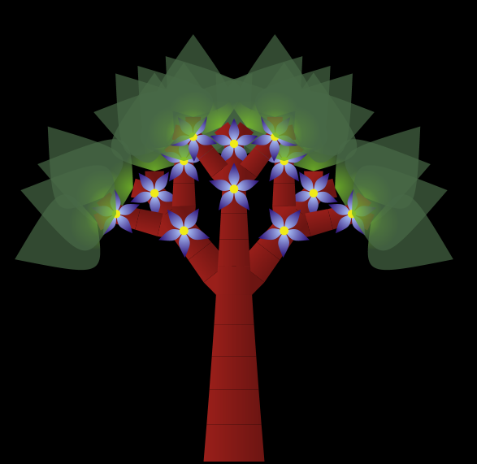
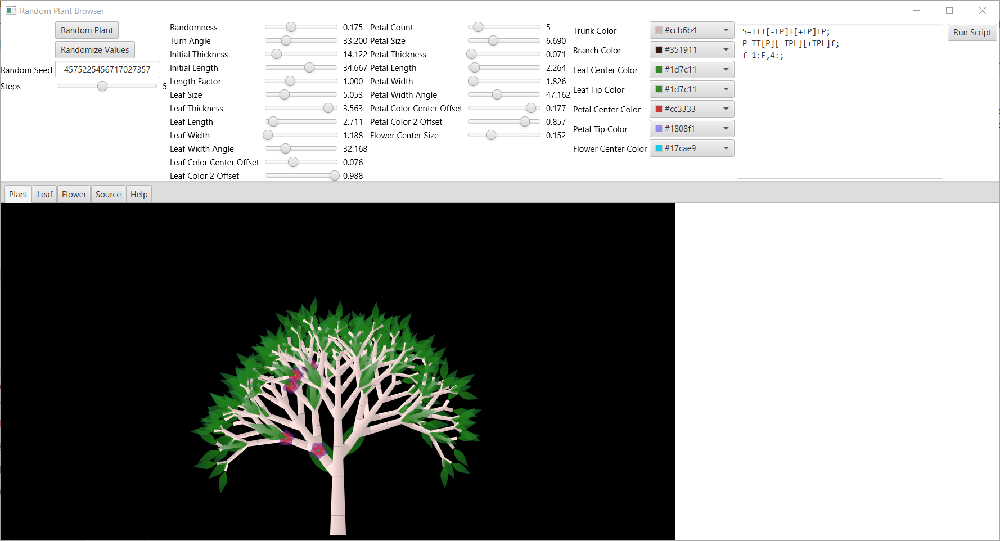
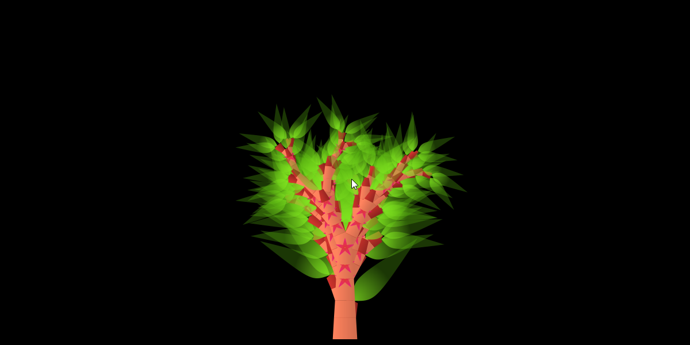
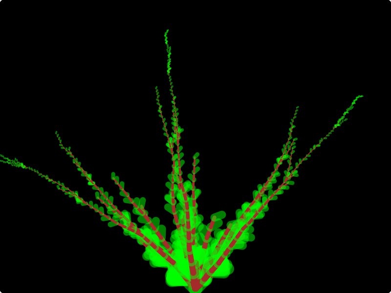
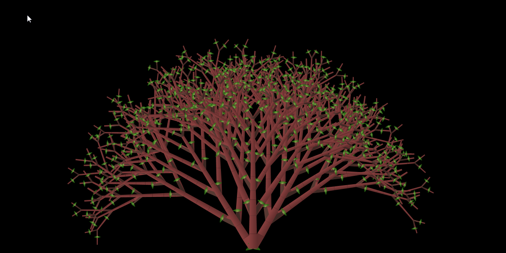
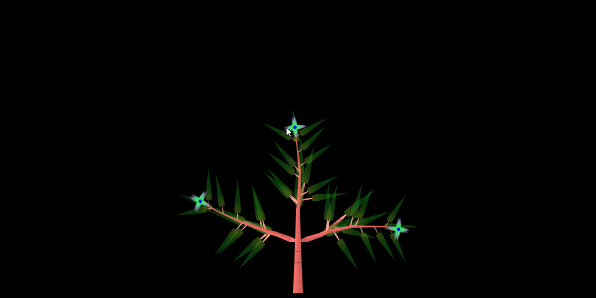
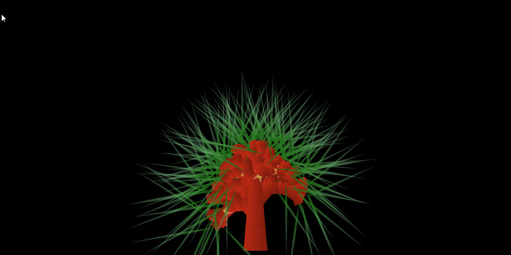
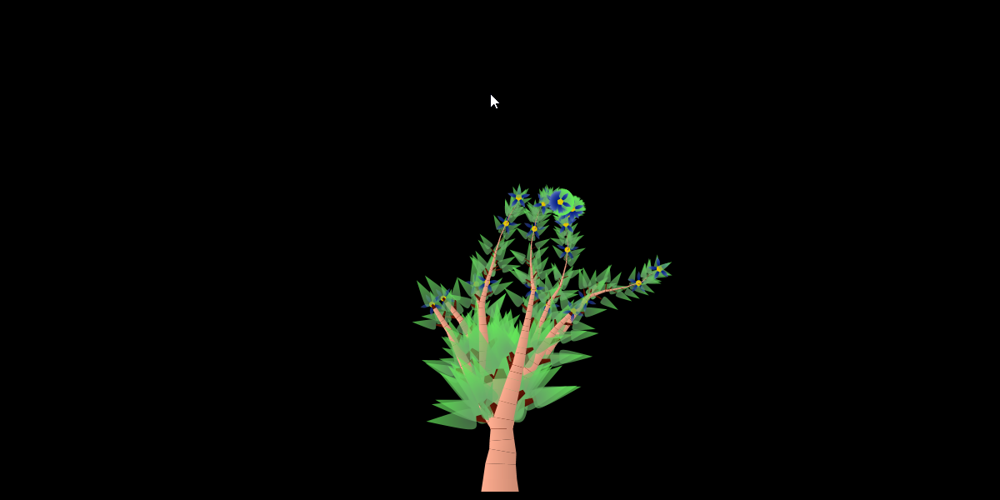

# plant-generator

Create plants using a Lindenmayer system.

The goal of this project is to be a proof of concept that it is possible to create natural looking plants for a 3D terrain.

## Overview

The implementation uses a stochastic [Lindenmayer System](https://en.wikipedia.org/wiki/L-system).

The following example shows a grammar for a typical plant.
```
S=TTTTT[-TP][+TP]TTP;
P=TT[P][-TPL][+TPL]F;
```

This script will produce a plant looking similar to this (depending on the randomized values like leaf/flower shape and color):




## Script Language

The script language consists of simple rules:

```
start "=" {command} ";"
```

The rules are executed repeatedly, replacing the start symbol with the commands to the right of the colon.

To make things more interesting stochastic rules are also possible with different probabilities for different variations.

```
start "=" probability : {command} { "," probability : {command} } ";"
```


The following commands are available:
- `S`	The start seed.
- `[`	Pushes the current state on the stack.
- `]`	Pops the current state from the stack (essentially restoring the state to what it was at the last [ command).
- `u`	Sets the growth angle up-wards.
- `d`	Sets the growth angle down-wards.
- `l`	Sets the growth angle horizontally left-wards.
- `r`	Sets the growth angle horizontally right-wards.
- `-`	Random angle a bit to the left.
- `+`	Random angle a bit to the right.
- `~`	Random angle.
- `T`	Grows a bit of trunk.
- `t`	Grows a bit of a thinner trunk.
- `L`	Grows a leaf.
- `f` Grows a flower.


## Plant Generator Viewer

A GUI application is available to explore the possibilities of this plant generator: 




## Screenshots

```
S=P;
P=5:PT[-Pt[-L]][+Pt[+L]]f,1:PT[-Pt[-L]],1:PT[+Pt[+L]];
f=F;
```



---

```
S=TTTTT[-TTTP][+TTTP]TTTTP;
P=P~T[-L]~T[+L]f;
f=1:F,4:;
```



---

```
S=[-LP][+LP][P];
P=TT[-TTP][+TTP][~-tL][~+tL]P;
```



---

```
S=TTTTT[-TTTP][+TTTP]TTTTP;
P=[PtL]~PT[-ttL]~PT[+ttL]TTPf;
f=[~tF][~tF][~tF];
```



---

```
S=TTT[-LP]T[+LP]TP;
P=T[-PT[-L]][+PT[+L]]f;
f=1:F,4:;
```



---

```
S=T~T~T~T~T~P;
P=[PtL]~PT[-ttL]~PT[+ttL]TTPf;
f=[tF];
```


